# Scenario 6: GitHub App with mise and gcx

Single Grafana instance with Git Sync authenticated through a GitHub App. This scenario runs Grafana 13.2 and ngrok with 18 dashboards across applications, business, infrastructure, and security, using mise tasks and your existing gcx installation.

Browse the [dashboard catalog](grafana/README.md) for the architecture diagram and links to every dashboard and its JSON definition.

## Architecture

```mermaid
graph LR
    User[User] --> Grafana[Grafana Instance]
    Grafana <--> |Git Sync via GitHub App| GitHub[GitHub Repository]
    Ngrok[ngrok Tunnel] --> Grafana

    style Grafana fill:#f96332
    style GitHub fill:#333
```



The GitHub App credentials are stored in a Grafana `Connection` named `github-app`. The `Repository` named `git-sync-github-app` references that connection and synchronizes `6-github-app/grafana/`. Grafana manages installation tokens using the app's private key; no GitHub Personal Access Token is required for this scenario.

## Prerequisites

- Docker with the Docker Compose plugin (`docker compose`).
- [mise-en-place](https://mise.jdx.dev/getting-started.html), Bash, curl, and `envsubst` (provided by GNU gettext) on your PATH.
- [gcx](https://github.com/grafana/gcx) installed and available on your PATH.
- Python 3 for the optional `setup-users` task (standard library only).
- An ngrok account with a static domain and auth token.
- A GitHub repository containing this scenario on the branch you intend to sync.
- A GitHub App installed on that repository, with its App ID, installation ID, and downloaded private key.

mise runs the tasks using the tools already on your PATH. No tool installation through mise is needed. The included `gcx.yaml` uses the context-based [configuration supported by gcx 0.2.15](https://github.com/grafana/gcx/blob/v0.2.15/docs/reference/configuration/index.md).

Run one scenario at a time: this scenario retains Grafana port **3000** from Scenario 1.

## Create and install the GitHub App

If you already have an app, check its permissions and repository installation against these steps. See [Grafana's GitHub App prerequisites](https://grafana.com/docs/grafana/latest/as-code/observability-as-code/git-sync/git-sync-setup/set-up-before/#create-a-github-app) for the upstream instructions.

1. Open [GitHub App registration](https://github.com/settings/apps/new), or your organization's **Settings → Developer settings → GitHub Apps**.
2. Choose a unique app name and set the homepage URL to your public ngrok URL. In the **Webhook** section, clear **Active**; Grafana configures repository webhooks for Git Sync.
3. Under **Repository permissions**, configure:

   | Permission | Access |
   | --- | --- |
   | Administration | Read-only |
   | Contents | Read and write |
   | Metadata | Read-only |
   | Pull requests | Read and write |
   | Webhooks | Read and write |

4. Select **Only on this account** for installation availability, then create the app.
5. Copy the numeric **App ID** (not the Client ID). Generate a private key and store the downloaded PEM file **outside this repository**.
6. Select **Install App**, choose your account, and grant access to the repository used for this demo.
7. Copy the numeric **installation ID** from the installation page URL, such as `https://github.com/settings/installations/12345678`.

## Configure the environment

Use the shared repository-root `.env`. If you do not already have one, copy `.env.example` to `.env` from the repository root. If it already exists, add the app variables without replacing your existing settings. mise loads `../.env` through the `[env]` configuration for all scenario tasks.

```dotenv
NGROK_AUTHTOKEN=your_ngrok_authtoken
NGROK_SUBDOMAIN=https://your-domain.ngrok-free.app
GITHUB_REPO=https://github.com/your_username/campfire-using-git-sync-demo
GITHUB_BRANCH=main
GITHUB_APP_ID=123456
GITHUB_APP_INSTALLATION_ID=12345678
GITHUB_APP_PRIVATE_KEY=base64_encoded_pem_contents
```

`GITHUB_APP_PRIVATE_KEY` contains the base64-encoded contents of the downloaded PEM file, as required by [Grafana 13.2's GitHub App validation](https://github.com/grafana/grafana/blob/v13.2.0/apps/provisioning/pkg/connection/github/validator.go). Generate a single-line value locally, then paste it into the gitignored `.env`:

```bash
base64 < "/absolute/path/outside/the/repository/github-app.pem" | tr -d '\r\n'
```

Keep the original PEM outside the repository and the encoded value in `.env`. `setup-resources` substitutes that value into `connection.yaml`; it does not read or encode a PEM file itself. `GITHUB_PAT` may remain configured for other scenarios, but this scenario does not use it.

The configured remote branch must already contain `6-github-app/grafana/`. Commit and push the new scenario to your fork, or select a branch where it is already present, before configuring Git Sync.

## Configure gcx contexts

`setup-resources` selects `localhost` in your normal gcx configuration, using gcx's [configuration lookup rules](https://github.com/grafana/gcx/blob/v0.2.15/docs/reference/cli/gcx_config.md). It does not pass the scenario's `gcx.yaml` as `--config`. Configure `localhost` to target `http://localhost:3000`, organization 1, with `admin` / `admin` basic authentication.

The current tasks select their configuration as follows:

| Task | Configuration | Context |
| --- | --- | --- |
| `setup-resources` | Normal gcx configuration, including `GCX_CONFIG` if set | `localhost` |
| `setup-users` | This scenario's `gcx.yaml` | Its current context, initially `default` |
| `clean` | This scenario's `gcx.yaml` | `localhost` |

The supplied `gcx.yaml` defines only `default`. Before using `clean`, add a `localhost` context with the same Grafana connection settings to that file. Ensure the contexts used by all three tasks point to the same instance and organization.

## Quick start

From the repository root:

```bash
cd 6-github-app
mise trust

mise run start
mise run health
```

Once Grafana is healthy, continue from the same directory:

```bash
mise run setup-resources
mise run ngrok-url
mise run open
```

Login at `http://localhost:3000` with `admin` / `admin`.

`start` starts the containers. `setup-resources` runs directly from `mise.toml`: it renders `connection.yaml` and `repository.yaml` with `envsubst` into temporary YAML files, then pushes the Connection before the Repository with gcx. A failed command stops the task. It does not validate required environment values or wait for Grafana readiness, so fill the variables above and wait for a healthy instance before running it.

`mise run ngrok-url` prints `NGROK_SUBDOMAIN` from the environment loaded by mise. It reports an error if the value is empty or missing. Use `mise run logs-ngrok` or `mise run health` to check the tunnel; the URL task only displays the configured address.

If you previously started this scenario with the image renderer, run `mise run start` to apply the updated services and remove the old renderer container. Run `mise run setup-resources` again to apply the disabled dashboard preview setting to an existing Git Sync repository.

The YAML files are templates; `setup-resources` supplies their environment values. The current task has incomplete temporary-file cleanup: its second `EXIT` trap replaces the first, leaving the rendered Connection file and the initial `mktemp` files behind. The Connection file contains the encoded private key. Remove those files from the system temporary directory after use; `mise run clean` does not remove them.

## Admin account and email

The initial admin email is **daniele.ferru@grafana.com**, configured through `GF_SECURITY_ADMIN_EMAIL` in `docker-compose.yml`. Grafana's [admin email setting](https://grafana.com/docs/grafana/latest/setup-grafana/configure-grafana/#admin_email) applies when the initial admin account is created.

`gcx.yaml` holds the credentials used to connect as `admin`; its [configuration schema](https://github.com/grafana/gcx/blob/v0.2.15/docs/reference/configuration/index.md) has no email field or user-provisioning settings. The email is noted there in a comment for reference. Grafana authenticates the supplied credentials and enforces the account's permissions on the server. Setting `user: admin` in a client file does not grant admin privileges.

The email is an initial value, not a continuously enforced policy. With an existing `grafana-data` volume, changing the Compose setting or restarting Grafana does not update the account. Sign in as `admin`, open **Profile**, edit the email, and save it; see [Edit your profile](https://grafana.com/docs/grafana/latest/administration/user-management/user-preferences/#edit-your-profile). Additional users have their own profiles; this setting only applies to the initial admin.

## Create additional users with mise

`users.json` defines the accounts managed by `mise run setup-users`:

| Username | Display name | Email | Organization 1 role | Password environment variable |
| --- | --- | --- | --- | --- |
| `editor` | Editor | `editor@example.com` | Editor | `GRAFANA_EDITOR_PASSWORD` |
| `viewer` | Viewer | `viewer@example.com` | Viewer | `GRAFANA_VIEWER_PASSWORD` |

Edit that file to change the demo emails or add users. JSON lets the helper use Python's standard library without an additional YAML parser. Each entry contains `login`, `name`, `email`, `role`, and `password_env`; passwords belong in the root, gitignored `.env` or exported environment variables.

Add your chosen passwords to the root `.env` before creating the accounts. Use shell quoting for spaces and special characters:

```dotenv
GRAFANA_EDITOR_PASSWORD='replace-with-your-editor-password'
GRAFANA_VIEWER_PASSWORD='replace-with-your-viewer-password'
```

Then, from this scenario directory:

```bash
mise run start
mise run setup-users
```

mise loads the root `.env`, then the helper uses `gcx api` with the local `gcx.yaml`. The helper passes no explicit context, so it uses the configured current context (`default` in the supplied file, unless overridden through gcx configuration). It requires the configured account's actual Grafana server administrator privileges and basic authentication. New users are created through the [Admin API](https://grafana.com/docs/grafana/latest/developer-resources/api-reference/http-api/api-legacy/admin/#global-users); profiles and membership are managed through the [User API](https://grafana.com/docs/grafana/latest/developer-resources/api-reference/http-api/api-legacy/user/) and [Organization API](https://grafana.com/docs/grafana/latest/developer-resources/api-reference/http-api/api-legacy/org/).

Each run matches existing usernames, updates their names and emails, and applies the requested role in organization 1. Passwords are required only for new accounts; existing passwords are never reset. `Admin` means organization Admin. The task refuses to manage server administrators or the account authenticating the requests, and it never deletes users. Removing an entry from the file leaves that account in Grafana.

Definitions, email conflicts, and required creation passwords are checked before any writes. Passwords are passed to gcx through standard input, without temporary credential files. API errors stop the task with a nonzero exit status; successful earlier changes remain, and rerunning finishes the setup. If Grafana is still starting, retry after it is healthy. These settings are applied when the task runs; there is no continuous user synchronization. `setup-users` is separate from `start` and `setup-resources`.

## Tasks

Run these tasks from `6-github-app` through `mise run`:

| Command | Purpose |
| --- | --- |
| `mise run help` | List tasks |
| `mise run start` | Start services |
| `mise run setup-resources` | Render and push the app connection and Git Sync repository |
| `mise run setup-users` | Create or update the users and organization roles in `users.json` |
| `mise run stop` | Stop services, retaining their data volume |
| `mise run restart` | Restart services |
| `mise run logs` | Follow all service logs |
| `mise run logs-grafana` | Follow Grafana logs |
| `mise run logs-ngrok` | Show ngrok logs |
| `mise run ngrok-url` | Print `NGROK_SUBDOMAIN` loaded from `.env` |
| `mise run open` | Open Grafana |
| `mise run open-ngrok` | Open the ngrok dashboard |
| `mise run open-all` | Open both dashboards |
| `mise run health` | Check Grafana health and ngrok startup logs |
| `mise run status` | Show service status |
| `mise run clean` | Remove this scenario's Git Sync resources, containers, and volumes |

`clean` requests deletion of `repositories/git-sync-github-app` followed by `connections/github-app`, then runs Docker Compose teardown with volume removal. It uses `--config=gcx.yaml --context=localhost`; see [Configure gcx contexts](#configure-gcx-contexts). Cleanup errors remain visible, and Docker teardown still runs if Grafana is already stopped or the resources are absent. The task does not uninstall the GitHub App or remove the root `.env`, original PEM, or setup task's leftover temporary files.

## Inspect Git Sync

To inspect the same context used by `setup-resources`, run from this scenario directory:

```bash
gcx config list-contexts
gcx --context=localhost resources get connections/github-app
gcx --context=localhost resources get repositories/git-sync-github-app
gcx --context=localhost resources get dashboards
```

In Grafana, open **Administration → Provisioning → Git Sync** to inspect connection and synchronization status. Dashboards are imported from `6-github-app/grafana/` into a folder named **Git Sync GitHub App**, with a 60-second sync interval.

Each dashboard folder (`applications`, `business`, `infrastructure`, and `security`) includes a [`_folder.json` manifest](https://grafana.com/docs/grafana-cloud/learn-and-build/as-code/observability-as-code/git-sync/use-git-sync/#the-git-sync-folder-metadata-file). Its `metadata.name` stores a stable folder UID, and `spec.title` supplies the display name in Grafana. Keep the UID unchanged when moving or renaming a folder; move its manifest along with its dashboards.

The included UIDs are for a new setup. If these folders have already been synced without metadata, set each manifest's `metadata.name` to that folder's existing UID from its Grafana URL before syncing these files. This preserves the existing folder identity and permissions. Commit and push the manifests to the configured branch so Git Sync can read them.

Once configured, you can edit dashboards in Grafana or Git, write directly to the configured branch, or use the branch and pull request workflow. Dashboard image previews on pull requests are disabled because this scenario does not run an image renderer.

## Troubleshooting

- **mise shell configuration warning:** The scenario uses `[settings].unix_default_inline_shell_args`, which is supported by mise 2026.3.9. That version does not support `[task_config].shell`.
- **gcx not found:** Ensure the directory containing your installed gcx executable is on your PATH before running mise. This scenario does not declare a gcx tool dependency or download it from GitHub.
- **User setup errors:** Ensure Python 3 is installed, Grafana is ready, and `gcx.yaml` contains working server administrator credentials. Set the password variables named in `users.json` for accounts that do not yet exist. Reruns preserve existing passwords.
- **Missing app inputs:** Set `GITHUB_APP_ID`, `GITHUB_APP_INSTALLATION_ID`, and `GITHUB_APP_PRIVATE_KEY` in the root `.env`. Use numeric IDs and the base64-encoded PEM contents. `envsubst` leaves an empty value for an unset variable; the task has no separate input validation.
- **Context not found:** `setup-resources` requires `localhost` in your normal gcx configuration; `clean` requires it in this scenario's `gcx.yaml`. The supplied local file defines only `default`. Follow [Configure gcx contexts](#configure-gcx-contexts).
- **Connection or repository errors:** Check that the app is installed on the selected repository with the permissions listed above. Inspect the resources with gcx and read `mise run logs-grafana`.
- **Grafana still starting:** Check `mise run health`, `mise run status`, and `mise run logs-grafana`, then run `mise run setup-resources` once Grafana is healthy. The setup task has no readiness wait.
- **No dashboards:** Confirm that the selected remote branch contains `6-github-app/grafana/`, and inspect Git Sync status. Local unpushed files are not synchronized.
- **Ngrok:** `mise run ngrok-url` displays the configured address; use `mise run logs-ngrok` to inspect tunnel activity. `NGROK_SUBDOMAIN` must contain your full static HTTPS URL.
- **Ports already in use:** Stop the other scenario before starting this one.

## References

- [Set up Git Sync as code](https://grafana.com/docs/grafana/latest/as-code/observability-as-code/git-sync/git-sync-setup/set-up-code/)
- [gcx 0.2.15 configuration reference](https://github.com/grafana/gcx/blob/v0.2.15/docs/reference/configuration/index.md)
- [mise task configuration](https://mise.jdx.dev/tasks/task-configuration.html)
