# GitHub App dashboards

This directory contains the 17 dashboard definitions synchronized by [Scenario 6](../README.md) through Git Sync with GitHub App authentication. They are organized into [Applications](applications/) (9 dashboards) and [Infrastructure](infrastructure/) (8 dashboards), under **Git Sync GitHub App** in Grafana.

Follow the [scenario setup guide](../README.md#quick-start) to configure the demo with mise and gcx. The links below open dashboard JSON definitions and repository folders. Each folder has its own README with dashboard descriptions and a `_folder.json` manifest defining its Grafana folder identity.

## Architecture

```mermaid
graph LR
    User[User] --> Grafana[Grafana Instance]
    Grafana <--> |Git Sync via GitHub App| GitHub[GitHub Repository]
    Ngrok[ngrok Tunnel] --> Grafana

    style Grafana fill:#f96332
    style GitHub fill:#333
```

## Dashboards

### [Applications](applications/)

Application performance, service health, user analytics, and business metrics. See the [Applications guide](applications/README.md) for descriptions of all 9 dashboards.

- [API Performance](applications/api-performance.json)
- [Application Logs](applications/application-logs.json)
- [Database Metrics](applications/database-metrics.json)
- [KPI Overview](applications/kpi-overview.json)
- [Revenue Metrics](applications/revenue-metrics.json)
- [Sales Pipeline](applications/sales-pipeline.json)
- [Service Health](applications/service-health.json)
- [User Engagement](applications/user-engagement.json)
- [Web Analytics](applications/web-analytics.json)

### [Infrastructure](infrastructure/)

Compute resources, networking, cloud costs, and security. See the [Infrastructure guide](infrastructure/README.md) for descriptions of all 8 dashboards.

- [Access Control & Authentication](infrastructure/access-control.json)
- [Cloud Resources](infrastructure/cloud-resources.json)
- [Docker Containers](infrastructure/docker-containers.json)
- [Kubernetes Cluster](infrastructure/kubernetes-cluster.json)
- [Load Balancers](infrastructure/load-balancers.json)
- [Networking](infrastructure/networking.json)
- [Security Overview](infrastructure/security-overview.json)
- [Vulnerability Scan & Compliance](infrastructure/vulnerability-scan.json)
