# GitHub App dashboards

The 18 dashboards in this directory are synchronized by [Scenario 6](../README.md), using a GitHub App, mise, and gcx.

## Architecture

```mermaid
graph LR
    User[User] --> Grafana[Grafana Instance]
    Grafana <--> |Git Sync via GitHub App| GitHub[GitHub Repository]
    Ngrok[ngrok Tunnel] --> Grafana

    style Grafana fill:#f96332
    style GitHub fill:#333
```

## Dashboards

Browse the dashboard JSON definitions by folder.

### Applications

- [API Performance](applications/api-performance.json)
- [Application Logs](applications/application-logs.json)
- [Database Metrics](applications/database-metrics.json)
- [Service Health](applications/service-health.json)
- [Web Analytics](applications/web-analytics.json)

### Business

- [KPI Overview](business/kpi-overview.json)
- [Revenue Metrics](business/revenue-metrics.json)
- [Sales Pipeline](business/sales-pipeline.json)
- [User Engagement](business/user-engagement.json)

### Infrastructure

- [Cloud Resources](infrastructure/cloud-resources.json)
- [Docker Containers](infrastructure/docker-containers.json)
- [Kubernetes Cluster](infrastructure/kubernetes-cluster.json)
- [Load Balancers](infrastructure/load-balancers.json)
- [Networking](infrastructure/networking.json)

### Security

- [Access Control & Authentication](security/access-control.json)
- [New dashboard](security/new-dashboard.json)
- [Security Overview](security/security-overview.json)
- [Vulnerability Scan & Compliance](security/vulnerability-scan.json)
