# GitHub App dashboards

The 18 dashboards in this directory are synchronized by [Scenario 6](../README.md), using a GitHub App, mise, and gcx.

## Architecture

```mermaid
graph LR
    User[User] --> Grafana[Grafana Instance]
    Grafana <--> |Git Sync via GitHub App| GitHub[GitHub Repository]
    Ngrok[ngrok Tunnel] --> Grafana

    style Grafana fill:#f96332
    style GitHub fill:#333
```

## Dashboards

Dashboard links open the local Grafana instance at `http://localhost:3000` in organization 1. Start Scenario 6 and synchronize its resources before opening them. The JSON links open the dashboard definitions in this repository.

### Applications

| Dashboard | Definition |
| --- | --- |
| [API Performance](http://localhost:3000/d/api-performance/api-performance?orgId=1) | [JSON](applications/api-performance.json) |
| [Application Logs](http://localhost:3000/d/application-logs/application-logs?orgId=1) | [JSON](applications/application-logs.json) |
| [Database Metrics](http://localhost:3000/d/database-metrics/database-metrics?orgId=1) | [JSON](applications/database-metrics.json) |
| [Service Health](http://localhost:3000/d/service-health/service-health?orgId=1) | [JSON](applications/service-health.json) |
| [Web Analytics](http://localhost:3000/d/web-analytics/web-analytics?orgId=1) | [JSON](applications/web-analytics.json) |

### Business

| Dashboard | Definition |
| --- | --- |
| [KPI Overview](http://localhost:3000/d/kpi-overview/kpi-overview?orgId=1) | [JSON](business/kpi-overview.json) |
| [Revenue Metrics](http://localhost:3000/d/revenue-metrics/revenue-metrics?orgId=1) | [JSON](business/revenue-metrics.json) |
| [Sales Pipeline](http://localhost:3000/d/sales-pipeline/sales-pipeline?orgId=1) | [JSON](business/sales-pipeline.json) |
| [User Engagement](http://localhost:3000/d/user-engagement/user-engagement?orgId=1) | [JSON](business/user-engagement.json) |

### Infrastructure

| Dashboard | Definition |
| --- | --- |
| [Cloud Resources](http://localhost:3000/d/cloud-resources/cloud-resources?orgId=1) | [JSON](infrastructure/cloud-resources.json) |
| [Docker Containers](http://localhost:3000/d/docker-containers/docker-containers?orgId=1) | [JSON](infrastructure/docker-containers.json) |
| [Kubernetes Cluster](http://localhost:3000/d/kubernetes-cluster/kubernetes-cluster?orgId=1) | [JSON](infrastructure/kubernetes-cluster.json) |
| [Load Balancers](http://localhost:3000/d/load-balancers/load-balancers?orgId=1) | [JSON](infrastructure/load-balancers.json) |
| [Networking](http://localhost:3000/d/networking/networking?orgId=1) | [JSON](infrastructure/networking.json) |

### Security

| Dashboard | Definition |
| --- | --- |
| [Access Control & Authentication](http://localhost:3000/d/access-control/access-control-authentication?orgId=1) | [JSON](security/access-control.json) |
| [New dashboard](http://localhost:3000/d/ddfz9inslanpq8c/new-dashboard?orgId=1) | [JSON](security/new-dashboard.json) |
| [Security Overview](http://localhost:3000/d/security-overview/security-overview?orgId=1) | [JSON](security/security-overview.json) |
| [Vulnerability Scan & Compliance](http://localhost:3000/d/vulnerability-scan/vulnerability-scan-compliance?orgId=1) | [JSON](security/vulnerability-scan.json) |
